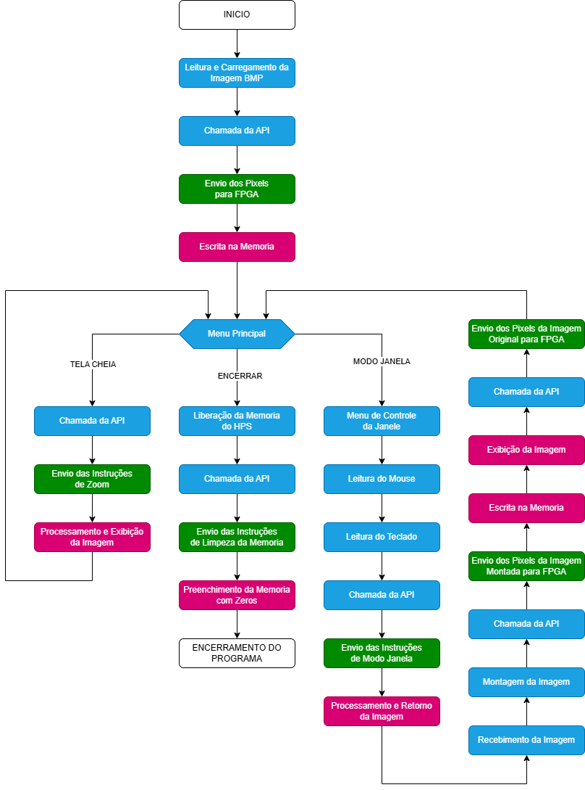
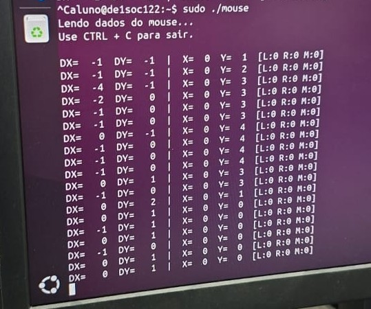
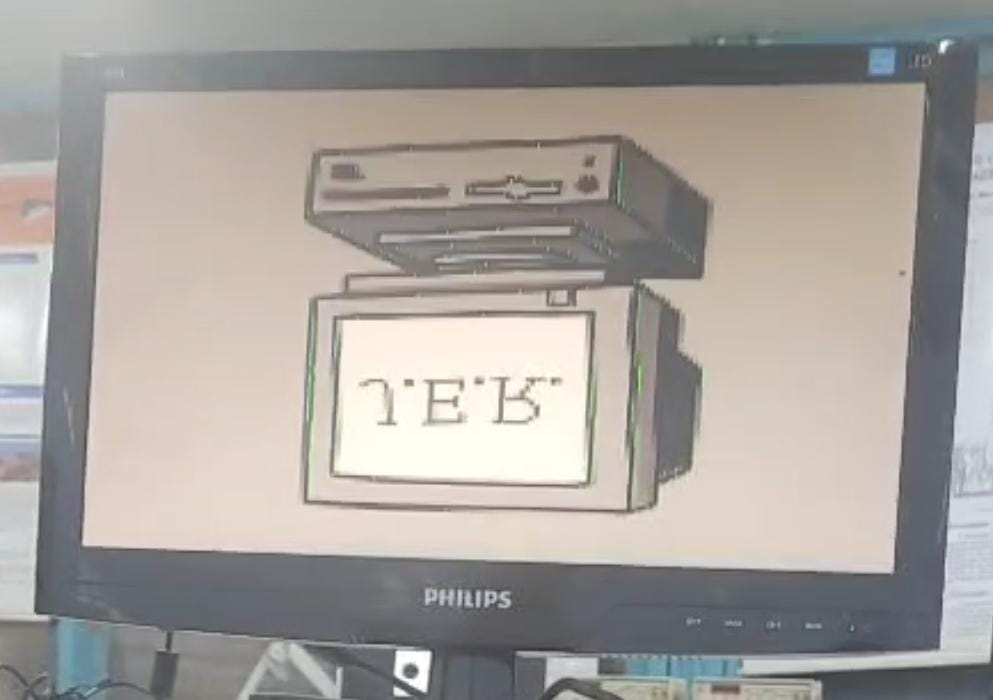
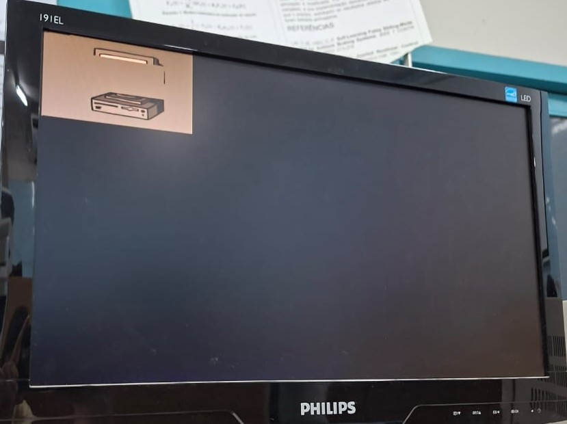
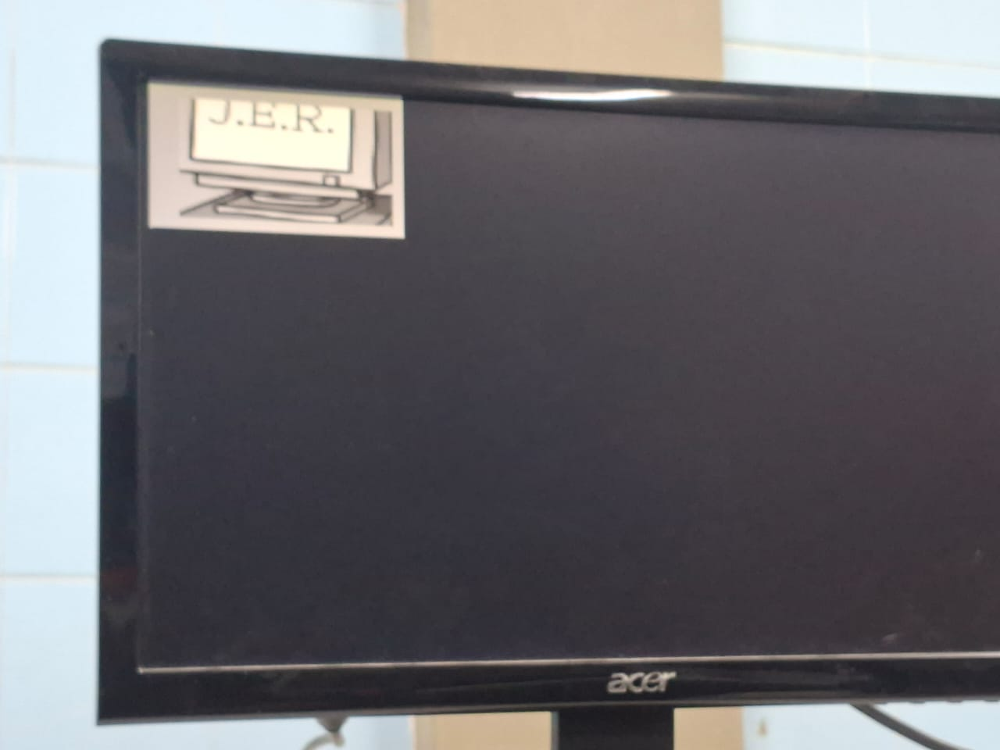

# Sistema de Redimensionamento de Imagens Embarcado

## Sumário

* [Softwares Utilizados](#softwares-utilizados)
* [Hardwares Utilizados](#hardwares-utilizados)
* [Instalação e Configuração do Ambiente](#instalação-e-configuração-do-ambiente)
* [Especificações do Projeto](#especificações-do-projeto)

* [1. Introdução](#1-introdução)
  * [1.1 Requisitos](#11-requisitos)
  * [1.2 Etapas de Desenvolvimento](#12-etapas-de-desenvolvimento)

* [2. Fundamentação Teórica](#2-fundamentação-teórica)
  * [2.1 Programação Híbrida e ABI (Application Binary Interface)](#21-programação-híbrida-e-abi-application-binary-interface)
  * [2.2 Acesso ao Hardware via Memória Virtual e mmap](#22-acesso-ao-hardware-via-memória-virtual-e-mmap)
  * [2.3 Interface de Dispositivos e Protocolo do Mouse](#23-interface-de-dispositivos-e-protocolo-do-mouse)
  * [2.4 Manipulação e Estrutura de Arquivos BMP](#24-manipulação-e-estrutura-de-arquivos-bmp)
  * [2.5 Algoritmos de Processamento de Imagens e Zoom](#25-algoritmos-de-processamento-de-imagens-e-zoom)

* [3. Arquitetura e Implementação](#3-arquitetura-e-implementação)
  * [3.1 Organização do Sistema em Camadas](#31-organização-do-sistema-em-camadas)
  * [3.2 Estratégias de Implementação](#32-estratégias-de-implementação)
  * [3.3 Comunicação e Sincronismo HPS-FPGA](#33-comunicação-e-sincronismo-hps-fpga)
  * [3.4 Mapa de Registradores e Conjunto de Instruções (ISA)](#34-mapa-de-registradores-e-conjunto-de-instruções-isa)

* [4. Testes e Erros](#4-testes-e-erros)
  * [4.1 Teste de Periféricos de Entrada (Mouse e Arquivos)](#41-teste-de-periféricos-de-entrada-mouse-e-arquivos)
  * [4.2 Teste do Modo Janela (Hardware-in-the-Loop)](#42-teste-do-modo-janela-hardware-in-the-loop)
  * [4.3 Teste de Transição de Estados](#43-teste-de-transição-de-estados)
  * [4.4 Conclusão dos Testes](#44-conclusão-dos-testes)

* [5. Resultados e Conclusão](#5-resultados-e-conclusão)
  * [5.1 Resultados Obtidos](#51-resultados-obtidos)
  * [5.2 Análise de Desempenho](#52-análise-de-desempenho)
  * [5.3 Conclusão Geral](#53-conclusão-geral)
* [Autores](#autores)

---

## Softwares Utilizados

* **GCC (GNU Compiler Collection)** – utilizado para compilação dos módulos em C e para a etapa de linkagem final, gerando o executável do sistema.
* **GNU Assembler (AS)** – utilizado para montagem dos arquivos Assembly (.s), convertendo o código para módulos objeto.
* **Make (GNU Make)** – utilizado para automatizar o processo de compilação, organização das dependências e geração do executável.
* **Linux embarcado da DE1-SoC** – ambiente onde o Makefile é executado e onde o programa final roda, permitindo acesso a dispositivos de hardware via /dev/mem.
* **Quartus Prime Lite 23.1** – utilizado para síntese, compilação e programação da FPGA.

## Hardwares Utilizados
- **Kit de Desenvolvimento DE1-SoC** com FPGA Intel Cyclone V (5CSEMA5F31C6) e Processador ARM Cortex-A9 (HPS).
- **Monitor VGA** com resolução nativa de 640x480 @ 60 Hz.
- **Mouse USB** padrão para controle da interface de janela.
- **Computador host** para compilação, programação da FPGA via USB-Blaster II e acesso remoto da DE1-SoC.

---

## Especificações do Projeto

* **Formato de imagem suportado:** BITMAP 8 bits (256 tons de cinza).
* **Operações disponíveis:** Zoom In e Zoom Out com diferentes algoritmos de interpolação.
* **Funcionalidades:** Zoom utilizando uma janela interativa  definida pelo mouse.
* **Comunicação:** Ponte Lightweight HPS-FPGA.
* **Controle:** Via menu textual interativo no terminal Linux e Mouse USB.

---

## Instalação e Configuração do Ambiente
1. **Instalar o Quartus Prime Lite 23.1** no computador host.  
2. **Criar um novo projeto no Quartus** selecionando o dispositivo *Cyclone V 5CSEMA5F31C6* (DE1-SoC).  
3. **Adicionar os arquivos Verilog** correspondentes aos módulos do sistema (zoom in, zoom out, controlador, driver VGA, etc.).  
4. **Compilar o projeto** no Quartus e verificar a **ausência** de erros.  
5. **Gerar o arquivo de cabeçalho do sistema**, executando o comando abaixo no diretório do projeto do Quartus:  
*sopc-create-header-files "./soc_system.sopcinfo" --single hps_0.h --module hps_0*
6. **Programar a FPGA** via USB-Blaster II selecionando o arquivo .sof gerado.
7. **Conectar a saída VGA** da placa ao monitor para visualizar os resultados em tempo real.
8. **Conectar o Mouse USB** na porta USB OTG da placa (com adaptador) ou em uma das portas USB Host.
9. **Conectar-se à DE1-SoC** via SSH a partir do computador host: 
*ssh user@<endereço_ip_da_placa>*
10. **Transferir os arquivos** C, Assembly, arquivo de cabeçalho do HPS gerado e a imagem BMP para a DE1-SoC utilizando o comando scp:
*scp <usuario_fonte@endereco_IP>:/<diretorio_do_arquivo_fonte/arquivo_fonte> <usuario_destino@endereco_IP>:/<diretorio_do_arquivo_destino/arquivo_destino >*
11. **Compilar e executar os arquivos** utilizando o comando *make run*

---

# 1. Introdução

Este projeto consiste no desenvolvimento de um sistema embarcado híbrido (*Hardware/Software Co-design*) para o redimensionamento e exibição de imagens em tempo real, utilizando a plataforma **DE1-SoC** (Intel/Altera Cyclone V). O sistema explora a arquitetura SoC combinando a flexibilidade de software do processador **ARM Cortex-A9 (HPS)** com o desempenho de processamento paralelo da **FPGA**.

Nesta etapa final do projeto, o foco desloca-se para a camada de aplicação e integração de sistemas. Foi desenvolvida uma aplicação em **Linguagem C** que atua como interface principal, gerenciando a leitura de arquivos de imagem (**BMP**), a interação com o usuário via terminal e periféricos (**Teclado e Mouse**), e o controle do hardware dedicado através de uma API de baixo nível desenvolvida previamente em Assembly.

O sistema permite que o usuário carregue imagens, aplique algoritmos de *Zoom In* e *Zoom Out* (Vizinho Mais Próximo, Replicação e Média) e utilize um **Modo Janela interativo**. Neste modo, o usuário pode utilizar um mouse USB para selecionar uma "Região de Interesse" na tela, aplicando o zoom apenas na área delimitada, simulando funcionalidades de sistemas de vigilância profissional.

## 1.1 Requisitos

- **Linguagem de Alto Nível:** A aplicação principal e o controle lógico devem ser implementados em Linguagem C.
- **Integração de Drivers:** A aplicação em C deve encapsular e utilizar a API desenvolvida em Assembly (Etapa 2) para comunicação com a FPGA.
- **Manipulação de Arquivos:** O sistema deve ser capaz de ler arquivos de imagem no formato BMP (8-bit Grayscale) diretamente do sistema de arquivos do Linux embarcado.
- **Interface de Usuário (UI):** Implementação de um menu interativo via terminal de texto para seleção de operações.
- **Interatividade com Mouse:** Suporte a mouse USB (via `/dev/input/mice`) para capturar coordenadas $(x, y)$ e definir janelas de visualização na tela.
- **Modo Janela:** O sistema deve permitir desenhar a imagem ampliada sobre a imagem original (Overlay), respeitando os limites definidos pelo usuário com o mouse.
- **Hardware Compatível:** Uso exclusivo dos recursos da placa DE1-SoC, mantendo a comunicação via Ponte Lightweight HPS-to-FPGA.

## 1.2 Etapas de Desenvolvimento

O projeto foi estruturado em três fases incrementais:

* **Etapa 1 (Hardware):** Implementação do coprocessador gráfico em **Verilog** na FPGA, responsável pela geração de vídeo VGA, armazenamento em RAM e lógica aritmética dos algoritmos de zoom. [Repositório da Fase 1](https://github.com/Enzo-Caua/Coprocessador-Grafico).
* **Etapa 2 (API):** Desenvolvimento de uma API em **Assembly ARMv7** para manipular os registradores mapeados em memória, servindo como "ponte" entre o software e o hardware. [Repositório da Fase 2](https://github.com/Enzo-Caua/Sistema-de-Zoom).
* **Etapa 3 (Aplicação e Integração):** Desenvolvimento do software principal em **C**, integrando a leitura de arquivos BMP, drivers de mouse, lógica de janelas e a interface com o usuário, completando a solução do sistema embarcado.

---

# 2. Fundamentação Teórica

### 2.1 Programação Híbrida e ABI (Application Binary Interface)

Para combinar a eficiência do acesso a hardware em baixo nível com a facilidade de desenvolvimento de aplicações complexas, este projeto utiliza uma abordagem híbrida unindo **C** e **Assembly**.

A integração entre essas linguagens é regida pela **ABI (Application Binary Interface)** do ARM (padrão AAPCS - *Procedure Call Standard for the ARM Architecture*). Este padrão define como funções trocam dados:
- **Passagem de Parâmetros:** Os quatro primeiros argumentos de uma função são passados nos registradores `r0` a `r3`.
- **Valores de Retorno:** O resultado de uma função é retornado no registrador `r0`.
- **Preservação de Contexto:** A função chamada (callee) deve preservar certos registradores (como `r4`-`r11`) se for utilizá-los.

Neste projeto, a aplicação principal em **C** (`main.c`) gerencia a lógica de alto nível, arquivos e interface, enquanto invoca funções descritas em **Assembly** (`funcoes_HPStoFPGA.s`) para realizar as operações de escrita e leitura nos registradores físicos da FPGA, atuando efetivamente como um *driver* de modo usuário.

### 2.2 Acesso ao Hardware via Memória Virtual e `mmap`

Em um sistema operacional como o Linux rodando no ARM Cortex-A9, as aplicações executam em um espaço de **memória virtual** protegido. Isso significa que um programa não pode acessar diretamente os endereços físicos da Ponte Lightweight (`0xFF200000`) sem permissão do kernel.

Para contornar isso, utiliza-se a chamada de sistema (syscall) `mmap` (Memory Map).
1. O sistema abre o arquivo especial `/dev/mem`, que é uma imagem da memória física do sistema.
2. A função `mmap` cria um mapeamento entre uma página da memória física (onde reside a ponte da FPGA) e um endereço virtual no espaço do processo.
3. O software passa a ler e escrever nesse ponteiro virtual, e a **MMU (Memory Management Unit)** do processador traduz esses acessos para os endereços físicos correspondentes em tempo real, permitindo o controle do hardware.

### 2.3 Interface de Dispositivos e Protocolo do Mouse

No filosofia Unix/Linux, "tudo é um arquivo". Dispositivos de hardware são acessados através de arquivos especiais no diretório `/dev`.

O mouse é acessado via `/dev/input/mice`. A leitura deste arquivo retorna um fluxo de bytes contínuo que segue o protocolo genérico **PS/2** (ou ImPS/2), estruturado em pacotes de 3 bytes:
1. **Byte 1 (Header):** Contém o estado dos botões (Esquerdo, Direito, Meio) e bits de sinal para overflow e direção.
2. **Byte 2 (Delta X):** O deslocamento horizontal relativo desde a última leitura.
3. **Byte 3 (Delta Y):** O deslocamento vertical relativo.

A aplicação em C deve ler, decodificar e acumular esses valores relativos ("deltas") para calcular a posição absoluta $(X, Y)$ do cursor na tela, implementando limites (clipping) para garantir que o cursor permaneça dentro da resolução suportada (160x120).

### 2.4 Manipulação e Estrutura de Arquivos BMP

Diferente da etapa anterior, onde dados brutos eram usados, agora o sistema implementa um **parser** de arquivos BMP (Bitmap). O formato BMP armazena imagens sem compressão, facilitando o processamento embarcado.

A estrutura de leitura em C envolve:
1. **Leitura do Cabeçalho (54 bytes):** Validação da assinatura `'BM'`, extração da largura, altura e profundidade de cor (8 bits/pixel).
2. **Inversão Vertical:** O padrão BMP armazena os pixels da linha inferior para a superior (bottom-up). Como o driver VGA varre a tela de cima para baixo (top-down), o software deve realizar a inversão das linhas antes ou durante o envio para a FPGA.
3. **Tratamento de Cores:** Para imagens de 8 bits, o BMP utiliza uma paleta de cores. O sistema assume uma paleta em tons de cinza linear (onde o índice 0 é preto e 255 é branco) para enviar os valores de intensidade diretamente ao hardware.

### 2.5 Algoritmos de Processamento de Imagens e Zoom

O redimensionamento de imagens digitais envolve o mapeamento de pixels de uma malha de origem (imagem original) para uma malha de destino (tela ou janela de zoom). Este projeto implementa três técnicas distintas para realizar essas transformações, balanceando qualidade visual e custo computacional no hardware.

#### A. Interpolação pelo Vizinho Mais Próximo (NNI - Nearest Neighbor)
Utilizado nas operações de **Zoom In**, é o método mais simples e computacionalmente eficiente. Para cada pixel na imagem de destino, o algoritmo identifica o pixel correspondente mais próximo na imagem original e copia seu valor de intensidade sem realizar cálculos de mistura de cores.
*   **Implementação:** Matematicamente, consiste em um arredondamento simples das coordenadas mapeadas. Em hardware (FPGA), é implementado através de divisões de inteiros ou deslocamentos de bits (ex: para zoom 2x, o pixel da posição $x$ lê o endereço $x/2$ da memória).
*   **Característica:** Preserva as bordas nítidas, mas introduz o efeito de "pixelização" ou *aliasing* (serrilhado) em ampliações grandes.

#### B. Replicação de Pixels
Similar ao NNI, a replicação é uma técnica de **upscaling** onde cada pixel da imagem original é expandido para ocupar um bloco de $N \times N$ pixels na imagem de destino.
*   **Funcionamento:** Em um zoom de 2x, um único pixel original é copiado para quatro posições adjacentes na saída.
*   **Hardware:** Na arquitetura da FPGA, isso é realizado pela repetição da leitura do mesmo endereço de memória RAM enquanto o contador de varredura VGA avança, mantendo o dado estável na saída por múltiplos ciclos de clock.

#### C. Média de Blocos (Block Averaging)
Utilizado para as operações de **Zoom Out** (redução ou *downscaling*), este algoritmo atua como um filtro passa-baixa simples. Ao reduzir uma imagem, múltiplos pixels originais devem ser condensados em um único pixel de saída.
*   **Funcionamento:** Para reduzir uma imagem em 2x, o sistema lê um bloco de $2 \times 2$ pixels da imagem original, soma seus valores de intensidade e divide por 4.
*   **Implementação em Hardware:** Diferente do NNI, esta operação não é instantânea. A FPGA utiliza uma **máquina de estados** que realiza leituras sequenciais da memória RAM, acumula os valores em um registrador e realiza a divisão através de *bit-shifting* (deslocamento de bits para a direita), garantindo eficiência sem a necessidade de um divisor de hardware complexo. O resultado é uma imagem reduzida mais suave e com menos ruído visual (*aliasing*) do que se fossem apenas descartados pixels (decimação simples).

---

# 3. Arquitetura e Implementação

O sistema foi desenvolvido sobre uma arquitetura **SoC (System on Chip)**, onde o processamento é dividido entre o HPS (processamento de controle, arquivos e interface) e a FPGA (aceleração de cálculo de coordenadas e geração de vídeo). Conforme o diagrama abaixo:

  

## 3.1 Organização do Sistema em Camadas

A implementação segue uma abordagem em camadas, isolando a lógica de alto nível dos detalhes de hardware:

1.  **Camada de Aplicação (C - HPS):**
    *   **`main.c` / `menu.c`:** Gerencia o fluxo principal, exibe o menu textual e orquestra as transições de estado.
    *   **`mouse.c`:** Driver de espaço de usuário responsável por ler o arquivo de dispositivo `/dev/input/mice`, interpretar o protocolo PS/2 (deltas X/Y e botões) e manter o estado das coordenadas do cursor (clipping 160x120).
    *   **`carregar_BMP.c`:** Parser responsável por ler o arquivo de imagem do sistema de arquivos Linux, tratar o cabeçalho e armazenar os pixels brutos na RAM do HPS (`img_original`).

2.  **Camada de Controle e Composição (C - HPS):**
    *   **`controle_janela.c`:** Implementa a lógica do "Modo Janela". Atua como um laço de controle que solicita coordenadas à FPGA, busca pixels na memória do ARM e compõe a imagem final.
    *   **`montar_imagem.c`:** Realiza a composição gráfica (Overlay), inserindo a imagem processada (Zoom) dentro da área definida pelo retângulo do mouse sobre a imagem original.

3.  **Camada de Driver (C & Assembly - HPS):**
    *   **`funcoes_HPStoFPGA.s`:** Wrapper em Assembly que realiza a escrita física nos registradores da FPGA (via ponte LW).
    *   **`enviar_fpga.c`:** Implementa o protocolo de comunicação "bit-banging" para enviar pixels serialmente para a memória da FPGA.

4.  **Camada de Hardware (Verilog - FPGA):**
    *   **`ghdr_top.v`:** O módulo ghrd_top integra todos os periféricos da placa (como ADC, áudio, clocks, DRAM, VGA, GPIO, UART, QSPI, teclado PS/2, LEDs, switches e interfaces de comunicação) e realiza a conexão estruturada entre a FPGA e o HPS (processador ARM embutido), usando o sistema gerado pelo Qsys/Platform Designer (soc_system). Ele declara sinais internos, mapeia os pinos físicos da placa para as interfaces lógicas do HPS e dos blocos FPGA, organiza reset, eventos e comunicação entre subsistemas, e cria toda a infraestrutura necessária para que o HPS controle dispositivos externos e troque dados com lógica customizada dentro da FPGA. É, essencialmente, o topo completo do projeto que integra hardware programável, processador e periféricos em um único sistema funcional.
     *   **`controlador_JER.v`:** O módulo controlador_JER recebe a imagem original enviada pelo HPS, interpreta os comandos de zoom, algoritmo e modo de operação, processa os pixels aplicando cópia, interpolação ou médias conforme o algoritmo selecionado, e armazena o resultado em RAM interna. Ele controla toda a lógica de endereçamento, leitura, escrita e sincronização dos pixels, operando tanto no modo VGA — onde envia a imagem processada para exibição — quanto no modo janela, no qual devolve pixels ao HPS sob demanda. Em resumo, ele é o bloco central responsável por coordenar a ampliação, filtragem e disponibilização da imagem processada.

## 3.2 Estratégias de Implementação

### 3.2.1 Modo Janela
Diferente do zoom em tela cheia (onde a FPGA faz tudo), o Modo Janela implementa uma arquitetura de feedback inovadora para aproveitar os aceleradores de hardware da FPGA enquanto o software gerencia a exibição complexa.

O fluxo de dados no Modo Janela funciona da seguinte forma:
1.  **Definição:** O usuário define uma região de interesse (ROI) com o mouse.
2.  **Configuração:** O HPS envia para a FPGA o comando de zoom desejado (ex: NNI 2x) e ativa o modo "Cálculo de Coordenadas".
3.  **Loop de Feedback:**
    *   O HPS solicita o pixel para a posição $(x, y)$ da janela.
    *   A FPGA, em vez de devolver uma cor, calcula e devolve a **coordenada de origem** $(src\_x, src\_y)$ correspondente, aplicando o algoritmo selecionado (NNI ou Replicação) em hardware.
    *   O HPS usa essa coordenada para buscar a cor real na sua memória RAM (`img_original`).
    *   O HPS monta a imagem final e a envia de volta para a FPGA exibir.
    
Isso permite que a FPGA atue como uma **ALU gráfica**, calculando endereços complexos, enquanto o HPS cuida da lógica de janelamento.

### 3.2.2 Protocolo de Mouse e Coordenadas
O módulo de mouse foi implementado lendo o fluxo de bytes brutos do driver Linux. Foi necessário implementar um integrador de posição, pois o mouse envia apenas deslocamentos relativos ($\Delta x, \Delta y$). O software acumula esses valores e aplica operações de *clipping* (ceifamento) para garantir que o cursor virtual nunca saia das dimensões da imagem (0 a 159 no eixo X, 0 a 119 no eixo Y).

## 3.3 Comunicação e Sincronismo HPS-FPGA

A comunicação utiliza a **Ponte Lightweight HPS-to-FPGA (LW Bridge)** mapeada em memória. Foram definidos endereços específicos (PIOs) no Qsys/Platform Designer para diferentes funções:

*   **`PIO_HPSTOFPGA` (Saída HPS):** Envia comandos (bits de controle) e dados de pixels (durante a escrita).
*   **`PIO_STATUS` (Entrada HPS):** Sinaliza se a FPGA está pronta ou ocupada.
*   **`PIO_PROX_PIXEL` (Saída HPS):** Sinal de *handshake* utilizado no Modo Janela para solicitar o próximo cálculo de coordenada à FPGA.

Para garantir a integridade dos dados, foi implementado um mecanismo de *polling* nos drivers de baixo nível, onde o software aguarda a confirmação do hardware antes de enviar o próximo pacote de dados.

### 3.4 Mapa de Registradores e Conjunto de Instruções (ISA)

Para controlar o coprocessador na FPGA, o software manipula um registrador de 16 bits (`PIO_HPSTOFPGA`). A organização dos bits foi projetada para permitir o envio tanto de dados de pixel (durante a carga da imagem) quanto de comandos de configuração.

#### 3.4.1 Organização dos Bits (Bitfield)

A palavra de controle de 16 bits é estruturada da seguinte forma:

| Bits | Nome | Função / Descrição |
| :---: | :--- | :--- |
| **15** | `MODO_JANELA` | **0:** Modo Tela Cheia (FPGA gera vídeo direto). **1:** Modo Janela (HPS pede coordenadas, FPGA calcula). |
| **14:7** | `DADO_PIXEL` | Valor do pixel (8 bits) a ser escrito na RAM. |
| **6** | `CONTROLE_RAM` | Grava o dado dos bits [14:7] na memória. |
| **5:4** | `FATOR_ZOOM` | **00:** 1x (Original) **01:** 2x **10:** 4x |
| **3:0** | `ALGORITMO` | Seleciona o circuito de processamento: `0001`: NNI (Vizinho Mais Próximo) `0010`: Replicação `0100`: Zoom Out NNI `1000`: Média de Blocos |

#### 3.4.2 Tabela de Instruções (Opcodes)

O driver em Assembly (`funcoes_HPStoFPGA.s`) implementa as seguintes instruções hexadecimais, que são enviadas diretamente ao barramento para configurar o estado da FPGA:

| Mnemônico (Função C) | Código Hex | Binário (Bits 15..0) | Operação Hardware |
| :--- | :---: | :--- | :--- |
| `exibir_imagem_original` | **0x0000** | `0000 0000 0000 0000` | Reseta zoom e desativa janela. |
| `zoom_in_nni_2x` | **0x0011** | `0000 0000 0001 0001` | Zoom 2x via NNI (Tela Cheia). |
| `zoom_in_nni_4x` | **0x0021** | `0000 0000 0010 0001` | Zoom 4x via NNI (Tela Cheia). |
| `zoom_in_replicacao_2x` | **0x0012** | `0000 0000 0001 0010` | Zoom 2x via Replicação (Tela Cheia). |
| `zoom_in_replicacao_4x` | **0x0022** | `0000 0000 0010 0010` | Zoom 4x via Replicação (Tela Cheia). |
| `zoom_out_media_2x` | **0x0018** | `0000 0000 0001 1000` | Redução 2x com Filtro de Média. |
| `zoom_out_media_4x` | **0x0028** | `0000 0000 0010 1000` | Redução 4x com Filtro de Média. |
| **`zoom_in_nni_2x_janela`** | **0x8011** | `1000 0000 0001 0001` | Ativa feedback de coordenadas p/ Janela. |
| **`zoom_in_replicacao_2x_janela`** | **0x8012** | `1000 0000 0001 0010` | Ativa feedback de coordenadas p/ Janela. |

> **Nota:** As instruções de *Janela* (que começam com `0x8...`) instruem a FPGA a não enviar cor para o monitor, mas sim calcular qual coordenada $(SrcX, SrcY)$ corresponde ao pixel atual, permitindo que o software reconstrua a imagem recortada.

---

# 4. Testes e Erros

A validação da 3ª Etapa exigiu uma abordagem sistêmica, testando desde a leitura de periféricos no Linux até a sincronização fina entre o software em C e a lógica da FPGA. Os testes foram divididos em módulos funcionais.

## 4.1 Teste de Periféricos de Entrada (Mouse e Arquivos)

### 4.1.1 Leitura e Decodificação do Mouse
O primeiro desafio foi interpretar os dados brutos do mouse USB.
*   **Procedimento:** Foi desenvolvido um programa de teste isolado (`mouse.c`) que lê o arquivo `/dev/input/mice`.
*   **Problema Encontrado:** O protocolo PS/2 envia deslocamentos relativos ($\Delta x, \Delta y$) e não posições absolutas. Além disso, o movimento rápido gerava valores que estouravam os limites da tela.
*   **Solução:** Implementação de um integrador de software com *Clipping* (ceifamento). O código acumula os deltas e força as coordenadas a permanecerem dentro do intervalo $[0, 159]$ e $[0, 119]$.
*   **Validação:** Ao mover o mouse físico, os valores de $X$ e $Y$ impressos no terminal correspondiam exatamente aos limites da tela VGA, sem *overflow* ou comportamento errático.

 

### 4.1.2 Parser de Arquivo BMP
*   **Procedimento:** Carregamento de imagens `.bmp` de teste via `carregar_BMP.c`.
*   **Erro Observado:** As imagens apareciam "de cabeça para baixo" no monitor VGA.
*   **Causa:** O padrão BMP armazena os pixels da linha inferior para a superior (*Bottom-Up*), enquanto o driver VGA varre de cima para baixo.
*   **Solução:** Implementação da função `inverter_vertical()`, que realiza o espelhamento das linhas no buffer de memória antes do envio para a FPGA.

 

## 4.2 Teste do Modo Janela (Hardware-in-the-Loop)

Este foi o teste mais crítico, pois envolve um ciclo de feedback onde o HPS pede uma coordenada e a FPGA responde.

*   **Cenário:** O usuário desenha um retângulo no centro da tela e seleciona "Zoom In NNI 2x".
*   **Erro de Sincronismo (Race Condition):** Inicialmente, a imagem dentro da janela aparecia corrompida ou com pixels deslocados.
*   **Análise:** O processador ARM (800 MHz) executava as instruções de leitura do PIO mais rápido do que a FPGA (25 MHz) conseguia processar e atualizar o barramento de retorno.
*   **Solução:** Implementação de um protocolo de *Handshake* robusto com delays inseridos (`delay_simples` em `receber_fpga.c`). O HPS agora levanta um sinal (`PIO_NEXT`), aguarda um tempo seguro para estabilização elétrica e lógica, e só então lê o dado retornado.

 

## 4.3 Teste de Transição de Estados

*   **Procedimento:** Alternar rapidamente entre diferentes algoritmos (ex: de Zoom 2x para Original, depois para Zoom 4x).
*   **Erro Observado:** "Sujeira" visual ou artefatos na tela ao trocar de modo, devido a bits residuais no registrador de controle da FPGA.
*   **Solução:** Criação da função `aplicar_transicao_segura()` no menu. Antes de qualquer troca de algoritmo, o sistema força o envio do comando `0x0000` (Original) e aguarda 20ms (um quadro de vídeo), garantindo que a máquina de estados da FPGA seja resetada antes de receber nova configuração.

## 4.4 Conclusão dos Testes

Os testes confirmaram que a aplicação em C consegue gerenciar com sucesso a latência da comunicação com a FPGA. O sistema final permite desenhar janelas com o mouse e aplicar zoom em tempo real, comprovando o funcionamento da arquitetura híbrida onde a FPGA calcula as coordenadas (aceleração) e o HPS monta a interface final.

 

---

# 5. Resultados e Conclusão

## 5.1 Resultados Obtidos

A 3ª etapa do projeto consolidou a integração entre o sistema operacional Linux embarcado e o hardware customizado na FPGA, resultando em um sistema funcional de processamento de imagens controlado por software.

Os principais êxitos obtidos foram:
1.  **Integração Completa de Software:** A aplicação em C gerenciou com sucesso a leitura de arquivos **BMP** do sistema de arquivos, a captura de dados do **mouse USB** e o controle dos drivers de baixo nível, abstraindo a complexidade do hardware para o usuário final.
2.  **Modo Janela Funcional:** A implementação da arquitetura *Hardware-in-the-Loop* funcionou conforme projetado. O HPS conseguiu interrogar a FPGA sobre coordenadas de zoom e reconstruir a imagem apenas na região de interesse selecionada pelo mouse, sobrepondo-a à imagem original.
3.  **Estabilidade de Vídeo:** As técnicas de *handshake* e os delays de estabilização implementados no software eliminaram artefatos visuais e erros de sincronismo que ocorriam durante a troca rápida de algoritmos ou movimentação da janela.
4.  **Interface Interativa:** O sistema deixou de depender de chaves físicas (como na Etapa 1) e passou a oferecer uma interface amigável via terminal e mouse, simulando a operação de um sistema de vigilância real.

## 5.2 Análise de Desempenho

A análise técnica do sistema revelou comportamentos distintos entre os modos de operação:

*   **Modo Tela Cheia:** O desempenho é excelente. Como a FPGA realiza todo o processamento de pixel e geração de vídeo internamente, a carga sobre o processador ARM é mínima (apenas envio de comandos de configuração). A troca de algoritmos é instantânea.
*   **Modo Janela (Gargalo da Ponte):** Neste modo, o desempenho é limitado pela largura de banda da **Ponte Lightweight HPS-to-FPGA**. Como o HPS precisa solicitar a coordenada e ler a resposta pixel a pixel via registradores PIO (sem uso de DMA), há um *overhead* de comunicação significativo.
    *   Para a resolução alvo de **160x120 pixels**, a atualização é fluida e responsiva.
    *   Entretanto, testes indicam que escalar essa abordagem específica (pixel-a-pixel via PIO) para resoluções maiores (ex: 640x480) introduziria latência visível (*input lag*), evidenciando a necessidade futura de controladores de memória dedicados (DMA) para resoluções HD.

## 5.3 Conclusão Geral

Este projeto demonstrou na prática os desafios e vantagens do **Co-design Hardware/Software**. A utilização da plataforma **DE1-SoC** permitiu dividir as tarefas de forma eficiente: o processador **ARM Cortex-A9** lidou com a complexidade lógica (sistema de arquivos, mouse, interface de usuário), enquanto a **FPGA Cyclone V** acelerou as operações aritméticas de endereçamento e a geração de sinais de vídeo.

A evolução do Assembly para o C, somada à manipulação direta de memória virtual (`mmap`) e leitura de *device drivers* do Linux, proporcionou um aprendizado aprofundado sobre como sistemas embarcados modernos funcionam. O produto final é um sistema robusto, capaz de carregar imagens reais e permitir a análise detalhada via zoom interativo, cumprindo todos os requisitos propostos no problema.

---

# Autores

* **Enzo Cauã da S. Barbosa**
* **Jamile Letícia C. da Silva**
* **Rafael Sampaio Firmo**

Tutoria: **Prof. Dr. Ângelo Amâncio Duarte**
